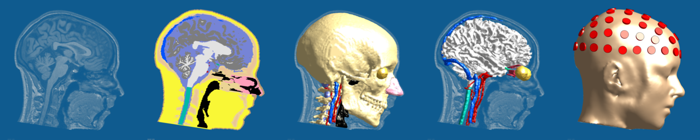

# IXI025 Model - IT'IS Template Head Segmentation Repository

The IXI025 head model is based on Subject 025 from the [IXI dataset](https://brain-development.org/ixi-dataset/). It includes a whole head segmentation, surface-based model, fiducials for 10-10 system construction, as well as the original anatomical (T1w, T2w, PD, MRA) and diffusion weighted images. The head segmentation/model is in the original scanner coordinates, i.e., it is perfectly aligned with the magnetic resonance images.

This dataset is made public to support research in computational brain stimulation modeling, e.g., transcranial electric, magnetic, and acoustic brain stimulation, as well as temporal interference (TI) stimulation. The head model is used for Sim4Life tutorials by IT'IS and its partner organization ZMT Zurich MedTech AG.

## Head Segmentation

The head segmentation is provided as [NIfTI (.nii.gz)](https://brainder.org/2012/09/23/the-nifti-file-format) file and includes the following tissues:

| ID  | Tissue Name           |
| --- | --------------------- |
| 1   | Skin                  |
| 2   | Bone_cortical         |
| 3   | Cerebrospinal_fluid   |
| 4   | Air_internal          |
| 5   | Eyes                  |
| 6   | Cerebrum_grey_matter  |
| 7   | Cerebrum_white_matter |
| 8   | Other_tissues         |
| 9   | Visual_Nerve          |
| 10  | Rectus_muscle         |
| 11  | Spinal_cord           |
| 12  | Mucosa                |
| 13  | Vein                  |
| 14  | Artery                |
| 15  | Bone_cancellous       |

The iSEG-compatible [tissue list](IXI025-Guys-0852-SEG.txt) can easily be parsed and provides the colors and names. Background is implicitly *ID=0*.

## Head Model

The head model is provided as binary *.stl* files. Each tissue surface is stored individually. The surfaces are oriented and compatible, i.e., triangles at interfaces between neighboring tissues share common vertices and triangles (except for the triangle orientation).

## 10-10 System

The 10-10 system fiducial points are provided as a *.csv* file, where the first column is the fiducial name, followed by *x*-, *y*-, and *z*-coordinates.

## License and Acknowledgement

This data is made available under the [Creative Commons CC BY-SA 3.0 license](https://creativecommons.org/licenses/by-sa/3.0/legalcode). If you use the head model (meshes or segmentation), please acknowledge it in your work (e.g., this github repository).
If you use the IXI data please acknowledge the source of the IXI data (e.g., [this website](https://brain-development.org/ixi-dataset/)).
